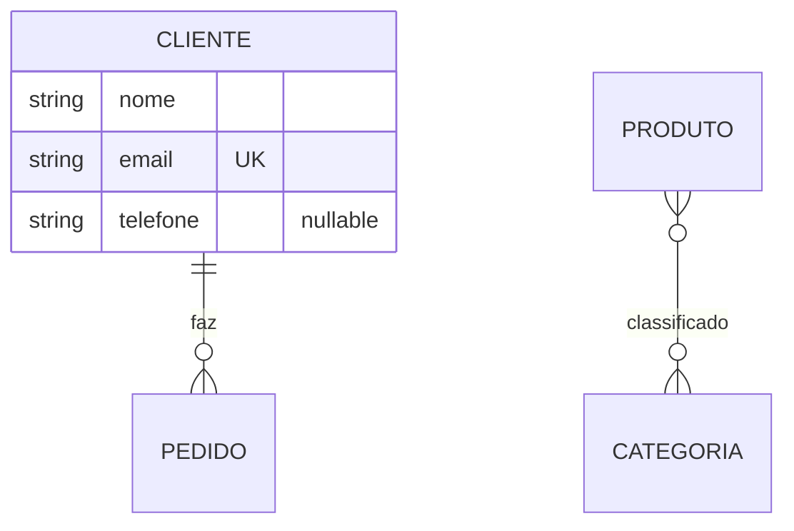

# Documentação de Uso — FastAPI Template

Guia completo de como usar o template no dia a dia: criar projetos, gerar
CRUDs, controlar permissões (RBAC) e administrar tudo pelo painel.

Documentos relacionados:
- [README.md](README.md) — setup inicial, stack e personalização visual do admin
- [GERENCIADOR_CLI.md](GERENCIADOR_CLI.md) — referência completa do CLI (pensada para LLMs)
- [COMANDOS_ALEMBIC.md](COMANDOS_ALEMBIC.md) — comandos de migration

---

## 1. Primeiros passos

```bash
uv sync                          # instala as dependências
cp .env.example .env             # configure (SQLITE_DEV=1 para dev local)
uv run python -m alembic upgrade head    # cria as tabelas
uv run python -m uvicorn app:app --app-dir src/projeto   # sobe a API
```

- API/Swagger: http://localhost:8000/docs
- Admin: http://localhost:8000/admin (entra com um usuário `is_admin`)

Para criar o primeiro admin, use o gerenciador (funciona em SQLite e PostgreSQL):

```bash
uv run python gerenciar.py create-superuser projeto \
  --nome "Admin" --email admin@empresa.com --password minhasenha
```

(ou pelo menu interativo, opção 9 — a senha é digitada de forma oculta).

---

## 2. O Gerenciador (`gerenciar.py`)

Todo o ciclo de vida de projetos e schemas é feito pelo gerenciador, que tem
**dois modos equivalentes**:

### Modo interativo (para humanos)

```bash
uv run python gerenciar.py
```

Menu com: criar projeto, listar/inspecionar projetos, criar schema (modelo +
rota CRUD + admin), editar schema (adicionar/remover campos) e remover schema.

### Modo CLI (para scripts e LLMs)

Os mesmos recursos via argumentos, com saída `--json` opcional:

```bash
uv run python gerenciar.py list-projects
uv run python gerenciar.py create-project loja --json
uv run python gerenciar.py create-schema loja Produto --field nome:str --field preco:float
uv run python gerenciar.py show-schema loja Produto
```

Referência completa de comandos, tipos e flags: [GERENCIADOR_CLI.md](GERENCIADOR_CLI.md).

---

## 3. Criando um projeto novo

```bash
uv run python gerenciar.py create-project minha_api
```

Isso gera `src/minha_api/` com: FastAPI + SQLModel, autenticação JWT
(`POST /token`), CRUD de usuário com recuperação de senha por email, painel
admin com tema Tailwind e o sistema RBAC completo.

Opções:

| Flag | Efeito |
|---|---|
| `--no-admin` | Sem painel admin (sai `admin/`, templates e middleware CSP) |
| `--no-rbac` | Sem RBAC — rotas restritas passam a ser admin-only via `UserByRole` |
| `--init-uv` | Roda `uv init` + `uv add` das dependências (repositório novo) |
| `--force` | Sobrescreve projeto existente |

Depois de criar:
1. Configure o `.env` (mesmas variáveis do template). Em dev (`SQLITE_DEV=1`)
   cada projeto usa seu próprio arquivo `database_<projeto>.db` — sem conflito
   entre projetos no mesmo repositório;
2. Gere e aplique as migrations: `uv run python gerenciar.py migrate minha_api`
   (o projeto já vem com setup alembic próprio em `src/minha_api/`);
3. Suba: `uv run python -m uvicorn app:app --app-dir src/minha_api`.

---

## 4. Criando um CRUD completo (schema + rotas + admin)

Um único comando cria o modelo, os schemas de entrada/saída, a rota CRUD
protegida por RBAC e a view no admin:

```bash
uv run python gerenciar.py create-schema projeto Produto \
  --field "nome:str" \
  --field "descricao:str:nullable" \
  --field "sku:str:unique,no-update" \
  --field "preco:float:default=0" \
  --field "estoque:int:default=0" \
  --field "ativo:bool:default=true" \
  --field "categoria:str:index" \
  --field "peso_kg:float:nullable" \
  --field "codigo_barras:str:unique,nullable" \
  --field "lancamento:date:nullable"
```

O que é gerado (exemplo real deste repositório):

| Arquivo | Conteúdo |
|---|---|
| `schemas/produto.py` | `ProdutoCreate`, `ProdutoUpdate`, `Produto` (tabela) e `ProdutoRead` |
| `schemas/__init__.py` | Import registrado (o alembic passa a enxergar a tabela) |
| `routes/produto.py` | CRUD fastcrud: `POST/GET/PATCH/DELETE /produto`, protegido por `verify_rbac` |
| `router.py` | Rota registrada |
| `admin/admin_view.py` + `admin_setup.py` | `ProdutoAdmin` no painel |

Todo modelo ganha automaticamente `id: UUID` (pk) e
`created_at`/`updated_at`/`deleted_at` (desative com `--no-timestamps`).

**Migration automática**: adicione `--migrate` ao comando e o gerenciador roda
o alembic (autogenerate + upgrade head) em seguida. Sem a flag, rode depois:

```bash
uv run python gerenciar.py migrate projeto -m "tabela produto"
```

### Formato dos campos

`nome:tipo[:flags]` — tipos: `int, float, str, bool, uuid, datetime, date`;
flags: `nullable, pk, unique, index, no-create, no-update, no-read, default=VALOR, fk=TABELA`.

- `no-create` → o campo não vem no `POST` (fica só na tabela);
- `no-update` → não editável via `PATCH` (ex: `sku`);
- `no-read` → não aparece nas respostas da API;
- `fk=tabela` → foreign key para `tabela.id`.

### Vários modelos de uma vez: diagrama Mermaid

Para criar um domínio inteiro (com FKs e relationships), desenhe um
`erDiagram` do Mermaid e importe:

```bash
uv run python gerenciar.py from-mermaid projeto diagrama.mmd --dry-run   # ver o plano
uv run python gerenciar.py from-mermaid projeto diagrama.mmd --migrate   # criar tudo + migration
```



Cada entidade vira um modelo completo com CRUD e admin; `1:N` gera a FK e os
`Relationship` dos dois lados; `N:N` gera a tabela de ligação automaticamente.
Sintaxe completa no [GERENCIADOR_CLI.md](GERENCIADOR_CLI.md).

### Evoluindo um schema existente

```bash
uv run python gerenciar.py show-schema projeto Produto        # estado atual
uv run python gerenciar.py add-field projeto Produto --field "cor:str:nullable"
uv run python gerenciar.py remove-field projeto Produto estoque
uv run python gerenciar.py remove-schema projeto Produto      # remove tudo
```

As edições preservam `Relationship(...)` e métodos da classe da tabela.
Relacionamentos entre modelos (FKs) são adicionados manualmente no arquivo —
depois disso as edições via CLI continuam funcionando.

---

## 5. Sistema RBAC (permissões por rota)

O RBAC controla **quais rotas cada usuário pode acessar**, gerenciado pelo
painel admin. Componentes:

### Como funciona

1. **Mapeamento automático**: no startup, `sync_permissions(app)` varre todas
   as rotas protegidas e sincroniza a tabela `Permission` (cria novas, remove
   as que saíram do código). Cada permissão tem um código `MÉTODO:path`, ex:
   `GET:/produto`.
2. **Verificação**: a dependência `verify_rbac` identifica a rota da request e
   libera se o usuário for admin, tiver a permissão direta, ou herdá-la de um
   grupo. Sem permissão → `403`.
3. **Atribuição**: pelo painel admin, tela **"Gerenciar Acessos"** (`/admin/rbac`):
   - **Grupos de Permissões** (roles): crie um grupo (ex: "Vendedores"),
     marque as rotas (checkboxes agrupadas por seção, com "marcar seção inteira")
     e os usuários membros;
   - **Acessos por usuário**: grupos + permissões diretas + painel de
     "acesso efetivo" mostrando a união do que ele pode acessar.

### Protegendo suas rotas

**Rotas fastcrud** (geradas pelo CLI): já vêm com `verify_rbac` em todas as
operações.

**Rotas manuais**: use o `RBACRouter` no lugar do `APIRouter`:

```python
from utils.rbac_router import RBACRouter, public_route

router = RBACRouter(prefix="/relatorio", tags=["Relatorio"])

@router.get("/")                 # exige a permissão "GET:/relatorio/"
async def listar(...): ...

@router.get("/aberto")
@public_route                    # fora do RBAC (mantém as próprias dependências)
async def aberto(...): ...
```

Ou injete a dependência direto: `Depends(verify_rbac)`.

### Endpoints úteis

- `GET /user/me/permissions` — retorna todas as rotas que o usuário logado tem
  acesso (admins recebem a lista completa). Ideal para o frontend montar menus.
- Rotas "self-service" (`/user/me`, atualizar/deletar a própria conta, cadastro,
  recuperação de senha) ficam fora do RBAC — só exigem autenticação.

### Regras

- `is_admin = True` → bypass total (acesso a tudo).
- Usuário comum sem permissões → só acessa as rotas públicas/self-service.
- Permissão pode vir **direta** ou **via grupo** — a união vale.

---

## 6. Painel Admin

- Login em `/admin` (usuários com `is_admin`).
- Views geradas pelo CLI aparecem automaticamente na sidebar.
- **Gerenciar Acessos** (`/admin/rbac`): gestão completa do RBAC (item 5).
- Personalização visual (cores, logo, nome): `admin/admin_config.py` —
  detalhes no [README.md](README.md#painel-administrativo).
- Senhas de usuários são hasheadas automaticamente ao criar/editar pelo painel.

---

## 7. Fluxo completo de exemplo

```bash
# 1. novo projeto com admin + rbac
uv run python gerenciar.py create-project loja

# 2. modelos do domínio (via mermaid, com migration automática)
uv run python gerenciar.py from-mermaid loja diagrama.mmd --migrate
#    ...ou modelo a modelo:
uv run python gerenciar.py create-schema loja Produto \
  --field nome:str --field preco:float --field sku:str:unique --migrate

# 3. cria o admin e sobe
uv run python gerenciar.py create-superuser loja --nome Admin --email admin@loja.com --password s3nh4
uv run python -m uvicorn app:app --app-dir src/loja
# -> /admin > Gerenciar Acessos > Novo Grupo "Vendedores"
#    marca as rotas de /produto e /cliente, adiciona os usuários
# -> o frontend consulta GET /user/me/permissions para montar o menu
```

## 8. Dicas e problemas comuns

- **403 em rota nova**: a rota é RBAC-protegida e o usuário não tem a
  permissão — atribua pelo "Gerenciar Acessos" (ou verifique se é admin).
- **Rota não aparece no "Gerenciar Acessos"**: o sync roda no startup —
  reinicie o servidor depois de criar rotas.
- **Erro de tabela inexistente**: faltou a migration — use `--migrate` nos
  comandos de schema ou rode `python gerenciar.py migrate <projeto>`.
- **`uv run alembic` falha** ("Failed to canonicalize script path"): use
  `uv run python -m alembic ...`.
- **Campo `id`/`created_at` no `--field`**: não declare — são automáticos.
