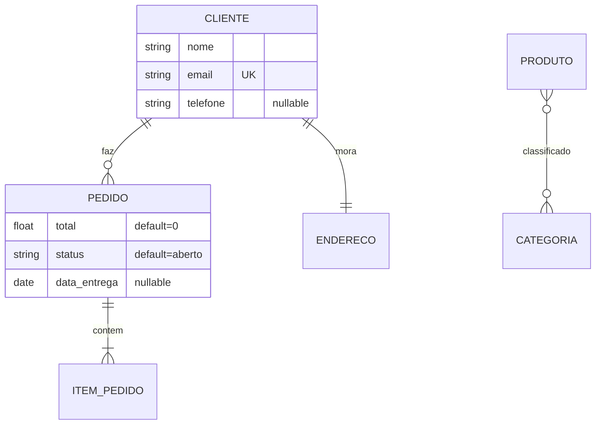

# Gerenciador CLI do FastAPI Template

Documentação de referência do `gerenciar.py` — escrita para que uma **LLM (ou
qualquer script) consiga criar e evoluir projetos inteiros** só com comandos.

```bash
# sempre a partir da raiz do repositório
uv run python gerenciar.py <comando> [argumentos] [--json]
```

- **Sem argumentos** abre o modo interativo (menus para humanos).
- **`--json`** em qualquer comando imprime o resultado como JSON em stdout —
  use sempre esta flag quando for uma LLM consumindo a saída.
- **Códigos de saída**: `0` sucesso; `1` erro. Erros vão para **stderr** — em
  modo `--json` no formato `{"error": "mensagem"}`.
- Os projetos vivem em `src/<nome_projeto>/`.

---

## Visão geral dos comandos

| Comando | O que faz |
|---|---|
| `list-projects` | Lista os projetos de `src/` com suas features e modelos |
| `create-project NOME` | Cria um projeto novo a partir do template |
| `inspect PROJETO` | Mostra features (admin/rbac), modelos e rotas |
| `list-schemas PROJETO` | Lista os modelos com todos os campos (detalhado no `--json`) |
| `show-schema PROJETO MODELO` | Mostra os campos de um modelo com todas as flags |
| `create-schema PROJETO MODELO --field ...` | Cria modelo + rota CRUD + admin |
| `add-field PROJETO MODELO --field ...` | Adiciona campo(s) a um modelo existente |
| `remove-field PROJETO MODELO CAMPO` | Remove um campo de um modelo |
| `remove-schema PROJETO MODELO` | Remove o modelo e todos os seus registros |
| `from-mermaid PROJETO ARQUIVO` | Lê um diagrama Mermaid `erDiagram` e gera todos os modelos, FKs, relationships e rotas |
| `migrate PROJETO [-m MSG]` | Gera (autogenerate) e aplica a migration do alembic |
| `create-superuser PROJETO --nome --email --password` | Cria um usuário admin no banco do projeto (SQLite ou PostgreSQL) |
| `docker-setup PROJETO` | Gera/atualiza o `docker-compose.yaml` (postgres com versão/extensões, minio, backend) |
| `add-celery PROJETO` | Adiciona Celery (worker, beat, flower) ao projeto, ao compose e ao painel admin |
| `docker-status` | Lista os serviços do `docker-compose.yaml` (gerenciados e manuais) |

Os comandos que alteram schemas (`create-schema`, `add-field`, `remove-field`,
`remove-schema`, `from-mermaid`) aceitam **`--migrate`** para gerar e aplicar a
migration automaticamente em seguida — o fluxo fica 100% automático.

---

## Especificação de campo (`--field`)

Formato: **`nome:tipo[:flag1,flag2,...]`**

**Tipos**: `int`, `float`, `str`, `bool`, `uuid`, `datetime`, `date`

**Flags** (todas opcionais, separadas por vírgula):

| Flag | Efeito |
|---|---|
| `nullable` | Campo pode ser nulo (`tipo \| None`) |
| `pk` | Primary key — substitui o `id: UUID` automático; implica `no-create,no-update` |
| `unique` | Índice único |
| `index` | Índice comum |
| `no-create` | Fora do schema `XCreate` (não vem no POST); declarado na tabela |
| `no-update` | Fora do schema `XUpdate` (não editável via PATCH) |
| `no-read` | Fora do schema `XRead` (não aparece nas respostas) |
| `default=VALOR` | Valor padrão (`int`/`float`/`bool` `true|false`/`str`) |
| `fk=TABELA` | Foreign key para `TABELA.id` (ou `fk=tabela.coluna`) |

Exemplos:

```bash
--field nome:str
--field preco:float:nullable
--field sku:str:unique,no-update
--field estoque:int:default=0
--field ativo:bool:default=true
--field observacao:str:nullable,no-read
```

**Automático em todo modelo** (não declare):
`id` (UUID pk, salvo se você declarar um campo `pk`), e `created_at` /
`updated_at` / `deleted_at` (desative com `--no-timestamps` no `create-schema`).

---

## Comandos em detalhe

### `create-project NOME [--no-admin] [--no-rbac] [--init-uv] [--celery] [--force] [--json]`

Cria `src/<nome>/` completo a partir do template: FastAPI + SQLModel + auth
JWT + rotas de usuário/login/recuperação de senha.

- **`--no-admin`** — sem o painel sqladmin (sai o diretório `admin/`,
  templates HTML e o middleware CSP).
- **`--no-rbac`** — sem o sistema de permissões por rota (sai `utils/rbac_router.py`,
  `schemas/rbac.py`, tela "Gerenciar Acessos" do admin; as rotas restritas
  passam a usar `UserByRole` de admin-only).
- **`--init-uv`** — roda `uv init` + `uv add` das dependências na raiz
  (só faz sentido em repositório novo).
- **`--celery`** — já roda o `add-celery` em seguida: worker/beat/flower no
  docker-compose e painel do Flower embutido no admin (veja `add-celery`).
- **`--force`** — sobrescreve um projeto existente com o mesmo nome.

Com RBAC ligado o projeto ganha: tabelas `Permission`/`PermissionGroup`,
mapeamento automático das rotas no startup, rota `GET /user/me/permissions`
e a tela "Gerenciar Acessos" no admin.

```bash
uv run python gerenciar.py create-project loja --json
uv run python gerenciar.py create-project api_interna --no-admin --no-rbac --json
```

Saída (`--json`): `{"project", "path", "features": {"admin", "rbac"}, "files", "next_steps": [...]}`

### `list-projects [--json]`

```bash
uv run python gerenciar.py list-projects --json
```

Saída: lista de `{"project", "path", "features": {"admin", "rbac"}, "models": [...], "routes": [...]}`.

### `inspect PROJETO [--json]`

Mesma estrutura de um item do `list-projects`, para um projeto só.
Use antes de editar, para saber se o projeto tem admin/rbac e quais modelos existem.

### `list-schemas PROJETO [--json]` / `show-schema PROJETO MODELO [--json]`

`show-schema` retorna cada campo com todas as flags:

```json
{
  "model": "Produto",
  "module": "produto",
  "timestamps": true,
  "fields": [
    {"name": "nome", "type": "str", "nullable": false, "pk": false,
     "unique": false, "index": false, "creatable": true, "updatable": true,
     "readable": true, "default": null, "auto": false}
  ],
  "file": "...", "warnings": []
}
```

`auto: true` = campo gerado pelo template (id/timestamps) — não pode ser removido.
`warnings` avisa quando o arquivo tem código manual que a edição via CLI não preserva.

### `create-schema PROJETO MODELO --field SPEC [--field SPEC ...] [opções] [--json]`

Cria **tudo de uma vez**:

1. `schemas/<modelo>.py` com as classes `XCreate`, `XUpdate`, `X` (tabela) e `XRead`;
2. registro em `schemas/__init__.py` (para o alembic enxergar a tabela);
3. `routes/<modelo>.py` com CRUD completo via fastcrud (protegido por
   `verify_rbac` se o projeto tem RBAC, senão `UserByRole([])`);
4. registro da rota em `router.py`;
5. view no admin (`admin_view.py` + `admin_setup.py`) se o projeto tem admin.

Opções: `--no-timestamps` (sem created_at/updated_at/deleted_at),
`--no-route` (pula 3 e 4), `--no-admin-view` (pula 5).

```bash
uv run python gerenciar.py create-schema loja Produto \
  --field nome:str \
  --field preco:float:nullable \
  --field sku:str:unique,no-update \
  --field estoque:int:default=0 \
  --json
```

O nome do modelo é normalizado para CamelCase (`produto` → `Produto`); o
arquivo/rota usam o minúsculo (`/produto`).

### `add-field PROJETO MODELO --field SPEC [--field SPEC ...] [--json]`

Adiciona campos a um modelo existente, regenerando as 4 classes do modelo no
arquivo. Métodos e `Relationship(...)` da classe da tabela são preservados;
código manual dentro de `Create/Update/Read` não é (um `warning` avisa).

```bash
uv run python gerenciar.py add-field loja Produto --field peso_kg:float:nullable --json
```

### `remove-field PROJETO MODELO CAMPO [--json]`

Remove o campo das 4 classes e limpa referências `Modelo.campo` na view do
admin. Campos `auto` (id/timestamps) não podem ser removidos.

### `remove-schema PROJETO MODELO [--json]`

Apaga `schemas/<modelo>.py` e `routes/<modelo>.py`, e remove os registros de
`schemas/__init__.py`, `router.py`, `admin_view.py` e `admin_setup.py`.

### `from-mermaid PROJETO ARQUIVO [--dry-run] [--no-route] [--no-admin-view] [--migrate] [--json]`

Lê um diagrama **Mermaid `erDiagram`** e gera todos os modelos de uma vez:
schemas, FKs, `Relationship` nos dois lados, rotas CRUD e views do admin.
Use `--dry-run` primeiro para ver o plano sem escrever nada.

Sintaxe suportada no diagrama:



Regras de conversão:

- **Entidades** viram modelos CamelCase (`ITEM_PEDIDO` → `ItemPedido`), cada
  uma com CRUD completo (5 rotas) e view no admin.
- **Atributos**: `tipo nome [PK|UK|FK] ["flags"]`. Tipos mermaid aceitos:
  `string/text/varchar → str`, `int/integer/bigint → int`,
  `float/double/decimal/numeric → float`, `bool/boolean → bool`, `date`,
  `datetime/timestamp → datetime`, `uuid`. Tipo desconhecido vira `str` (com aviso).
- O **comentário entre aspas** aceita as mesmas flags da CLI
  (`nullable`, `unique`, `index`, `no-create`, `no-update`, `no-read`,
  `default=VALOR`), separadas por vírgula. Texto que não é flag é ignorado.
- `id`, `created_at`, `updated_at`, `deleted_at` são automáticos (declarações
  de `id` no diagrama são ignoradas).
- **Relacionamentos**:
  - `A ||--o{ B` (1:N) → `B` ganha `a_id: UUID` (FK, indexada) + `Relationship`
    nos dois lados (`A.bs` / `B.a`);
  - `A ||--|| B` (1:1) → `B` ganha `a_id` com `unique=True`;
  - `A }o--o{ B` (N:N) → tabela de ligação `ABLink` gerada automaticamente
    (sem rota própria) + `Relationship(link_model=...)` nos dois lados;
  - `o` no lado "1" (ex: `|o--o{`) torna a FK `nullable`.
- Erro se algum modelo do diagrama já existir no projeto (remova antes com
  `remove-schema` ou renomeie a entidade).

```bash
uv run python gerenciar.py from-mermaid loja diagrama.mmd --dry-run --json   # ver o plano
uv run python gerenciar.py from-mermaid loja diagrama.mmd --migrate --json   # criar tudo + migration
```

### `migrate PROJETO [-m MENSAGEM] [--json]`

Gera a migration com `alembic revision --autogenerate` e aplica com
`upgrade head`. Se o alembic não detectar mudanças, a revisão vazia é
descartada (`"no_changes": true`).

- O projeto `projeto` usa o `alembic.ini` da raiz (setup original).
- Projetos criados pelo CLI têm setup alembic próprio em `src/<projeto>/`
  (criado automaticamente), com `version_table` exclusiva.
- **Banco de dev**: cada projeto gerado usa seu próprio arquivo SQLite
  (`database_<projeto>.db`), então não há conflito de tabelas entre projetos.
  Em produção, configure um banco (`DB_DATABASE`) por projeto no `.env`.

### `create-superuser PROJETO --nome NOME [--sobrenome S] --email EMAIL --password SENHA [--json]`

Cria um usuário com `is_admin=True` direto no banco do projeto — é ele que
loga no painel `/admin`. Usa a conexão do próprio projeto (`database.py` +
`.env`), então **funciona igual em SQLite (dev) e PostgreSQL (produção)** —
o campo `database` da resposta mostra qual backend foi usado.

- Se o email já existir, o usuário é **promovido a admin e a senha é
  atualizada** (`"status": "atualizado"`) — não duplica.
- A senha é hasheada com o mesmo algoritmo do projeto (pwdlib/Argon2).
- Requer a tabela `user` no banco: rode `migrate PROJETO` antes, se necessário
  (a mensagem de erro avisa).

```bash
uv run python gerenciar.py create-superuser loja \
  --nome "Maria" --sobrenome "Silva" --email admin@loja.com --password s3nh4 --json
```

Saída: `{"status": "criado" | "atualizado", "id", "email", "database", "project"}`

### `docker-setup PROJETO [--postgres-version N] [--extension EXT ...] [--no-minio] [--force] [--json]`

Gera (ou atualiza) o `docker-compose.yaml` da raiz com **postgres**, **minio**
(opcional) e o **backend** do projeto informado. O arquivo é dividido em blocos
marcados (`# <servico:postgres> ... # </servico:postgres>`): esses blocos são
regenerados pelo gerenciador a cada execução (idempotente), e **serviços
adicionados manualmente fora dos marcadores são preservados**.

- **`--postgres-version N`** — versão major do postgres (ex: `15`, `16`, `17`;
  padrão `17`).
- **`--extension EXT`** — extensão do postgres (repetível ou separada por
  vírgula). As extensões viram um `CREATE EXTENSION IF NOT EXISTS` em
  `docker/postgres-init.sql`, executado na primeira inicialização do volume.
  Casos especiais que trocam a imagem do banco automaticamente:
  `vector`/`pgvector` → `pgvector/pgvector:pgN`; `postgis` → `postgis/postgis:N-3.5`
  (as duas juntas não são suportadas — exigem imagem customizada).
- **`--no-minio`** — remove/não inclui o serviço minio.
- **`--force`** — se já existir um `docker-compose.yaml` **não gerenciado**
  (sem marcadores), substitui e salva um backup `.bak`.

As credenciais/portas vêm do `.env` da raiz via interpolação
(`${DB_USER:-db_user}`, `${DB_PORT:-5433}`...). Dentro da rede do compose o
backend já é configurado com `DB_HOST=postgres`, `DB_PORT=5432` e
`SQLITE_DEV=0` — o `.env` continua valendo para rodar fora do docker.

```bash
uv run python gerenciar.py docker-setup loja --postgres-version 17 --extension vector,pg_trgm --json
```

Saída: `{"project", "file", "backup", "postgres": {"version", "image", "extensions"}, "minio", "celery", "services", "warnings", "next_steps"}`

### `add-celery PROJETO [--no-beat] [--no-flower] [--no-admin-view] [--add-deps] [--force] [--json]`

Deixa o Celery pré-configurado de ponta a ponta:

1. `src/<projeto>/celery_app.py` (instância do Celery lendo
   `CELERY_BROKER_URL`/`CELERY_RESULT_BACKEND` do settings, com
   `beat_schedule` de exemplo) e `src/<projeto>/tasks.py` (task de exemplo);
2. campos `CELERY_BROKER_URL`, `CELERY_RESULT_BACKEND` e `FLOWER_URL` no
   `settings.py` do projeto + bloco correspondente no `.env`/`.env.example`;
3. serviços **redis**, **celery-worker**, **celery-beat** e **flower** no
   `docker-compose.yaml` (cria a base com padrões se o compose não existir) e
   atualiza o backend para enxergar o broker;
4. painel do **Flower embutido no admin** em `/admin/celery` (item "Celery
   (Flower)" na sidebar): view `admin/admin_celery.py` + template com iframe +
   liberação do `frame-src` no CSP do admin.

- **`--no-beat`** / **`--no-flower`** — pula o serviço correspondente.
- **`--no-admin-view`** — não embute o Flower no admin (fica só na porta 5555).
- **`--add-deps`** — roda `uv add "celery[redis]" flower` na raiz (sem isso, o
  `next_steps` lembra de instalar — as imagens docker precisam das dependências
  no `pyproject.toml`).
- **`--force`** — regenera `celery_app.py`/`tasks.py` se já existirem.

```bash
uv run python gerenciar.py add-celery loja --add-deps --json
```

Para rodar fora do docker (dev): `docker compose up -d redis` e, a partir de
`src/<projeto>`: `uv run celery -A celery_app worker --loglevel=info`
(no Windows adicione `--pool=solo`); o beat e o flower seguem o mesmo padrão
(`... beat` / `... flower`).

Saída: `{"project", "beat", "flower", "flower_admin", "deps_installed", "compose_services", "created", "warnings", "next_steps"}`

### `docker-status [--json]`

Mostra o estado do `docker-compose.yaml`: para qual projeto o backend está
configurado e cada serviço com a marcação `gerenciado` (regenerável pelo CLI)
ou `manual` (adicionado à mão, preservado pelo gerenciador).

```bash
uv run python gerenciar.py docker-status --json
```

Saída: `{"file", "exists", "managed", "project", "services": [{"name", "managed"}]}`

---

## Fluxo típico para uma LLM gerar um projeto completo

### Opção A — a partir de um diagrama Mermaid (recomendado para vários modelos)

```bash
# 1. criar o projeto
uv run python gerenciar.py create-project loja --json

# 2. escrever o erDiagram em um arquivo e conferir o plano
uv run python gerenciar.py from-mermaid loja diagrama.mmd --dry-run --json

# 3. criar tudo (modelos, FKs, relationships, rotas, admin) + migration
uv run python gerenciar.py from-mermaid loja diagrama.mmd --migrate --json

# 4. criar o superusuário do painel admin
uv run python gerenciar.py create-superuser loja \
  --nome Admin --email admin@loja.com --password s3nh4 --json

# 5. infraestrutura (opcional): docker-compose + celery
uv run python gerenciar.py docker-setup loja --postgres-version 17 --extension vector --json
uv run python gerenciar.py add-celery loja --add-deps --json

# 6. conferir
uv run python gerenciar.py inspect loja --json
uv run python gerenciar.py docker-status --json
```

### Opção B — modelo a modelo

```bash
# 1. criar o projeto (decida as features conforme o pedido do usuário)
uv run python gerenciar.py create-project loja --json

# 2. criar os modelos do domínio (com migration automática)
uv run python gerenciar.py create-schema loja Produto \
  --field nome:str --field preco:float --field estoque:int:default=0 --migrate --json
uv run python gerenciar.py create-schema loja Pedido \
  --field total:float --field produto_id:uuid:fk=produto --migrate --json

# 3. conferir o resultado
uv run python gerenciar.py inspect loja --json
uv run python gerenciar.py show-schema loja Produto --json

# 4. evoluir depois, conforme necessário
uv run python gerenciar.py add-field loja Produto --field codigo_barras:str:unique,nullable --migrate --json
uv run python gerenciar.py remove-field loja Produto estoque --migrate --json
```

### O que o CLI **não** faz (passos manuais depois)

- **`.env`**: o projeto novo usa as mesmas variáveis do template
  (veja `.env.example`). Em dev (`SQLITE_DEV=1`) cada projeto usa seu próprio
  arquivo `database_<projeto>.db` automaticamente.
- **Relationships que o Mermaid não expressa** (ex: auto-relacionamento):
  adicione manualmente no arquivo de schema — o analisador preserva esses
  trechos em edições futuras.
- **Subir o servidor**:
  `uv run python -m uvicorn app:app --app-dir src/<projeto> --port 8000`.

### Regras úteis para a LLM

1. Sempre use `--json` e leia stderr quando o exit code for `1` — as mensagens
   de erro dizem o que está disponível (projetos, modelos, campos, tipos, flags).
2. Antes de editar, rode `inspect`/`show-schema` para descobrir o estado atual —
   não assuma.
3. Não declare `id`, `created_at`, `updated_at`, `deleted_at` — são automáticos.
4. Modelos de infraestrutura (`User` faz parte do template; `Permission`,
   `PasswordReset`, `Token` nem aparecem na listagem) — não tente recriá-los.
5. Para **vários modelos relacionados**, prefira `from-mermaid` (um comando só,
   com FKs e relationships). Para um modelo avulso, `create-schema`.
6. Se `show-schema` retornar `warnings`, o arquivo tem código manual: prefira
   editar o arquivo diretamente em vez de usar `add-field`/`remove-field`.
7. Use `--migrate` nos comandos de schema para o banco ficar atualizado sem
   passos extras; ou rode `migrate PROJETO` ao final de uma sequência de mudanças.
